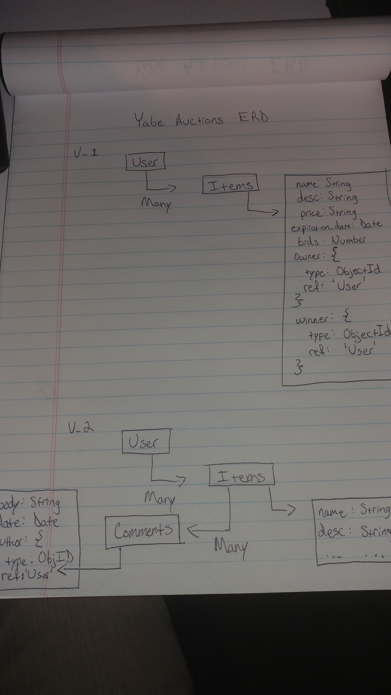

# Yabe Auctions Express Api

Auction Api back end database for Yabe Browser.

Technologies used in this project include Mongodb, Express, bcrypt, body-parser, Mongoose, passport and Heroku

This API recieves requests from cross-origin clients and responds with JSON snippets of User created Auction list items.

# Yabe Browser Repo:

https://github.com/jpetrucci49/yabe-browser

## Live Sites:

Browser - https://jpetrucci49.github.io/yabe-browser \
Server - https://yabe-server.herokuapp.com

### Unsolved Issues:

Still not tracking total bids, or img_src reference. \
No winner tracking yet implemented.

## ERD:



## API

Scripts are included in [`scripts`](scripts) to test built-in actions.

### Authentication

| Verb   | URI Pattern            | Controller#Action |
|--------|------------------------|-------------------|
| POST   | `/sign-up`             | `users#signup`    |
| POST   | `/sign-in`             | `users#signin`    |
| PATCH  | `/change-password/` | `users#changepw`  |
| DELETE | `/sign-out/`        | `users#signout`   |

#### POST /sign-up

Request:

```sh
curl --include --request POST http://localhost:4741/sign-up \
  --header "Content-Type: application/json" \
  --data '{
    "credentials": {
      "email": "an@example.email",
      "password": "an example password",
      "password_confirmation": "an example password"
    }
  }'
```

```sh
sh scripts/sign-up.sh
```

Response:

```md
HTTP/1.1 201 Created
Content-Type: application/json; charset=utf-8

{
  "user": {
    "id": 1,
    "email": "an@example.email"
  }
}
```

#### POST /sign-in

Request:

```sh
curl --include --request POST http://localhost:4741/sign-in \
  --header "Content-Type: application/json" \
  --data '{
    "credentials": {
      "email": "an@example.email",
      "password": "an example password"
    }
  }'
```

```sh
sh scripts/sign-in.sh
```

Response:

```md
HTTP/1.1 200 OK
Content-Type: application/json; charset=utf-8

{
  "user": {
    "id": 1,
    "email": "an@example.email",
    "token": "33ad6372f795694b333ec5f329ebeaaa"
  }
}
```

#### PATCH /change-password/

Request:

```sh
curl --include --request PATCH http://localhost:4741/change-password/ \
  --header "Authorization: Token token=$TOKEN" \
  --header "Content-Type: application/json" \
  --data '{
    "passwords": {
      "old": "an example password",
      "new": "super sekrit"
    }
  }'
```

```sh
TOKEN=33ad6372f795694b333ec5f329ebeaaa sh scripts/change-password.sh
```

Response:

```md
HTTP/1.1 204 No Content
```

#### DELETE /sign-out/

Request:

```sh
curl --include --request DELETE http://localhost:4741/sign-out/ \
  --header "Authorization: Token token=$TOKEN"
```

```sh
TOKEN=33ad6372f795694b333ec5f329ebeaaa sh scripts/sign-out.sh
```

Response:

```md
HTTP/1.1 204 No Content
```

### List items

List items represent Auction items stored on my DB. Commands for testing DB routes are

#### POST /items

```sh
curl --include --request POST http://localhost:4741/items \
  --header "Content-Type: application/json" \
  --header "Authorization: Bearer ${TOKEN}" \
  --data '{
    "item": {
      "name": "'"${NAME}"'",
      "desc": "'"${DESC}"'",
      "price": "'"${PRICE}"'",
    }
  }'
```

```sh
TOKEN=33ad6372f795694b333ec5f329ebeaaa NAME="Mystery Box" DESC="What's inside? Who knows? Gimme your money!" PRICE="\$20,000" sh scripts/items/create.sh
```

Response:

```md
HTTP/1.1 201 Created
Content-Type: application/json; charset=utf-8

{
  "item": {
    "_id": "1"
    "name": "Mystery Box",
    "desc": "What's inside? Who knows? Gimme your money!",
    "price": "$20,000"
  }
}
```

#### GET /items

Request:

```sh
curl --include --request GET http://localhost:4741/items/${ID} \
  --header "Content-Type: application/json" \
  --header "Authorization: Bearer 333desd82dd12rf2eh" \
```

```sh
TOKEN=33ad6372f795694b333ec5f329ebeaaa ID=1 sh scripts/items/show.sh
```

Response:

```md
HTTP/1.1 200 OK
Content-Type: application/json; charset=utf-8

{
  "item": {
    "_id": "1"
    "name": "Mystery Box",
    "desc": "What's inside? Who knows? Gimme your money!",
    "price": "$20,000"
  }
}
```

#### PATCH /items/:id

Request:

```sh
curl --include --request PATCH http://localhost:4741/items/${ID} \
  --header "Authorization: Bearer $TOKEN" \
  --header "Content-Type: application/json" \
  --data '{
    "item": {
      "name": "Bungee Cord",
      "desc": "Elastic bungee Cord",
      "price": "$15.24",

    }
  }'
```

```sh
TOKEN=33ad6372f795694b333ec5f329ebeaaa ID=1 NAME="Bungee Cord" DESC="Elastic bungee Cord" PRICE="\$15.24" sh scripts/items/update.sh
```

Response:

```md
HTTP/1.1 202 Accepted

{
  "item": {
    "n": 1,
    "nModified":1,
    "ok":1
  }
}

```

#### DELETE /items/

Request:

```sh
curl --include --request DELETE http://localhost:4741/items/${ID} \
  --header "Authorization: Bearer $TOKEN"
```

```sh
TOKEN=33ad6372f795694b333ec5f329ebeaaa ID=1 sh scripts/items/destroy.sh
```

Response:

```md
HTTP/1.1 204 No Content
```
